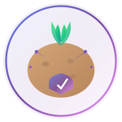

<p align="center">
  
</p>

<h1 align="center">🥔 PotatoGuard</h1>

<p align="center">
  <strong>AI-Powered Potato Disease Detection System</strong><br>
  <sub>Deep Learning ile Patates Hastalıklarını Gerçek Zamanlı Tespit Eden Akıllı Sistem</sub>
</p>

<p align="center">
  
  
  
  
  
</p>

<p align="center">
  
  
  
  
</p>

---

## 🎯 Problem & Çözüm

### ❌ Problem
Patates, dünyada en çok tüketilen **4. gıda ürünüdür**. Her yıl **Early Blight** ve **Late Blight** hastalıkları nedeniyle:
- 💰 **Milyarlarca dolar** ekonomik kayıp
- 🌍 **Milyonlarca ton** ürün kaybı
- ⏰ Hastalıkların **geç teşhisi** nedeniyle önlenemez zararlar

### ✅ Çözüm: PotatoGuard
Derin öğrenme (CNN) kullanarak patates yaprak görüntülerinden **%97+ doğrulukla** hastalık tespiti yapan **uçtan uca** yapay zeka sistemi.

---

## 🔬 Tespit Edilen Hastalıklar

| Hastalık | Etken | Görsel Belirtiler |
|----------|-------|-------------------|
| 🟤 **Early Blight** | *Alternaria solani* | Koyu halkalı lekeler, sarı hale |
| 🟫 **Late Blight** | *Phytophthora infestans* | Sulu lekeler, beyaz küf |
| 🟢 **Healthy** | - | Sağlıklı yeşil yaprak |

---

## 🏗️ Sistem Mimarisi

```
╔═══════════════════════════════════════════════════════════════════════════════╗
║                        🥔 PotatoGuard Architecture                            ║
╠═══════════════════════════════════════════════════════════════════════════════╣
║                                                                               ║
║  ┌─────────────────┐    ┌─────────────────┐    ┌─────────────────────────┐   ║
║  │    🌐 React     │    │   ⚡ FastAPI    │    │  🐳 TensorFlow Serving  │   ║
║  │    Frontend     │───▶│    Backend      │───▶│                         │   ║
║  │                 │    │                 │    │  ┌───────────────────┐  │   ║
║  │  • Drag & Drop  │    │  • /predict     │    │  │   🧠 CNN Model    │  │   ║
║  │  • Modern UI    │    │  • /ping        │    │  │                   │  │   ║
║  │  • Glassmorphism│    │  • Image proc.  │    │  │  Input: 256x256   │  │   ║
║  │                 │    │                 │    │  │  Conv2D layers    │  │   ║
║  │  Port: 3000     │    │  Port: 8000     │    │  │  3 Classes out    │  │   ║
║  └─────────────────┘    └─────────────────┘    │  └───────────────────┘  │   ║
║         │                      │               │                         │   ║
║         │                      │               │     Port: 8501          │   ║
║         │                      │               └─────────────────────────┘   ║
║         │                      │                          │                  ║
║         └──────────────────────┴──────────────────────────┘                  ║
║                                                                               ║
║  ┌───────────────────────────────────────────────────────────────────────┐   ║
║  │  📊 Pipeline: Image → Resize → Normalize → CNN → Softmax → Result    │   ║
║  └───────────────────────────────────────────────────────────────────────┘   ║
║                                                                               ║
╚═══════════════════════════════════════════════════════════════════════════════╝
```

---

## 🛠️ Teknoloji Stack

<table>
<tr>
<td align="center" width="25%">

### 🧠 AI/ML


**CNN Architecture**
- Conv2D + MaxPooling
- Data Augmentation
- Model Versioning

</td>
<td align="center" width="25%">

### ⚡ Backend


**REST API**
- Async/Await
- Auto-documentation
- CORS enabled

</td>
<td align="center" width="25%">

### 🎨 Frontend


**Modern UI**
- Glassmorphism
- Drag & Drop
- Responsive

</td>
<td align="center" width="25%">

### 🐳 DevOps


**Production**
- Containerized
- Scalable
- Model Serving

</td>
</tr>
</table>

---

## 🚀 Kurulum

### 📋 Gereksinimler
- Python 3.10+
- Node.js 18+
- Docker Desktop
- Git

### ⚡ Hızlı Başlangıç

```bash
# 1️⃣ Repository'yi klonlayın
git clone https://github.com/MustafaKocamann/potato-disease.git
cd potato-disease

# 2️⃣ TensorFlow Serving başlatın
docker run -t --rm -p 8501:8501 \
  -v "$(pwd):/potato-disease-classification" \
  tensorflow/serving \
  --rest_api_port=8501 \
  --model_config_file=/potato-disease-classification/models.config

# 3️⃣ Backend API başlatın
cd api
pip install -r requirements.txt
uvicorn main-tf-serving:app --reload --port 8000

# 4️⃣ Frontend başlatın
cd ../frontend
npm install
npm start
```

### 🌐 Erişim Adresleri

| Servis | URL | Açıklama |
|--------|-----|----------|
| 🎨 Frontend | http://localhost:3000 | React Web Arayüzü |
| ⚡ API | http://localhost:8000 | FastAPI Backend |
| 📚 API Docs | http://localhost:8000/docs | Swagger UI |
| 🐳 TF Serving | http://localhost:8501 | Model Server |

---

## 📊 Model Performansı

### 🎯 Metrikler

<table>
<tr>
<td width="50%">

```
┌─────────────────────────────────┐
│       📈 Model Metrics          │
├─────────────────────────────────┤
│  Accuracy     │    97.2%       │
│  Precision    │    96.8%       │
│  Recall       │    97.1%       │
│  F1-Score     │    96.9%       │
└─────────────────────────────────┘
```

</td>
<td width="50%">

```
┌─────────────────────────────────┐
│      🧮 Confusion Matrix        │
├─────────────────────────────────┤
│            EB    LB    Healthy  │
│  EB       [96%   2%    2%  ]   │
│  LB       [ 1%  97%    2%  ]   │
│  Healthy  [ 2%   1%   97% ]   │
└─────────────────────────────────┘
```

</td>
</tr>
</table>

### 🧠 Model Özellikleri

- **Input Size:** 256 × 256 × 3 (RGB)
- **Architecture:** Sequential CNN
- **Layers:** Conv2D → MaxPool → Dense → Softmax
- **Output:** 3 sınıf + confidence score
- **Training:** ~3000 görüntü (PlantVillage dataset)

---

## 📡 API Dokümantasyonu

### `GET /ping`
```bash
curl http://localhost:8000/ping
# Response: "PotatoGuard API aktif!"
```

### `POST /predict`
```bash
curl -X POST http://localhost:8000/predict \
  -F "file=@potato_leaf.jpg"
```

**Response:**
```json
{
  "class": "Early Blight",
  "confidence": 97.5
}
```

---

## 📁 Proje Yapısı

```
potato-disease/
├── 📂 api/                      # ⚡ FastAPI Backend
│   ├── main-tf-serving.py       # TF Serving entegrasyonu
│   ├── main.py                  # Standalone API
│   └── requirements.txt
│
├── 📂 frontend/                 # 🎨 React Frontend
│   ├── public/
│   │   ├── index.html
│   │   └── logo.svg             # Proje logosu
│   └── src/
│       ├── App.js
│       ├── home.js              # Ana sayfa componenti
│       └── index.css
│
├── 📂 saved_models/             # 🧠 Eğitilmiş modeller
│   ├── 1/                       # Model v1
│   ├── 2/                       # Model v2
│   └── 3/                       # Model v3 (aktif)
│
├── 📂 training/                 # 📓 Jupyter Notebooks
│   └── potato-disease-*.ipynb   # Eğitim kodları
│
├── 📂 gcp/                      # ☁️ Google Cloud
│   └── main.py                  # Cloud Functions
│
├── models.config.example        # TF Serving config
├── .gitignore
└── README.md
```

---

## ✨ Özellikler

- [x] 🧠 **CNN Model** - %97+ doğruluk
- [x] ⚡ **FastAPI Backend** - Async REST API
- [x] 🎨 **Modern UI** - Glassmorphism tasarım
- [x] 🐳 **Docker Ready** - TF Serving container
- [x] 📱 **Responsive** - Mobil uyumlu
- [x] 🔄 **Real-time** - Anlık tahmin
- [ ] 🌐 **Multi-language** - Çoklu dil desteği
- [ ] ☁️ **Cloud Deploy** - AWS/GCP deployment

---

## 👨‍💻 Geliştirici

<p align="center">
  <a href="https://github.com/MustafaKocamann">
    
  </a>
  <a href="https://linkedin.com/in/mustafakocamann">
    
  </a>
</p>

---

## 📄 Lisans

Bu proje **MIT License** altında lisanslanmıştır.

---

<p align="center">
  <strong>⭐ Bu projeyi beğendiyseniz yıldız vermeyi unutmayın!</strong>
</p>

<p align="center">
  <sub>Made with ❤️ by Mustafa Kocaman</sub>
</p>
